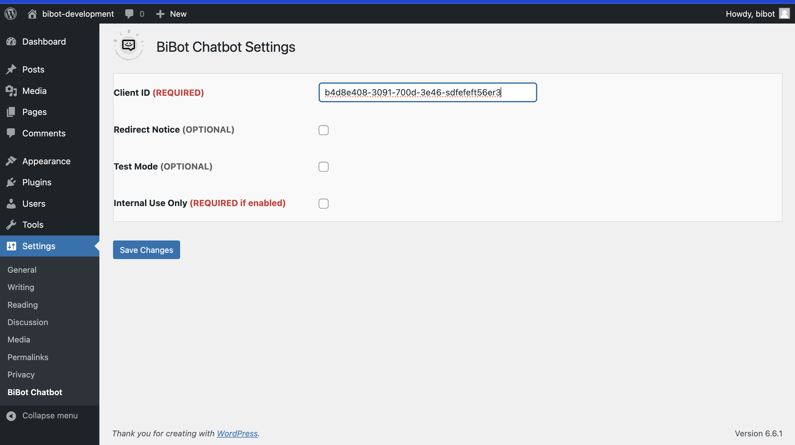
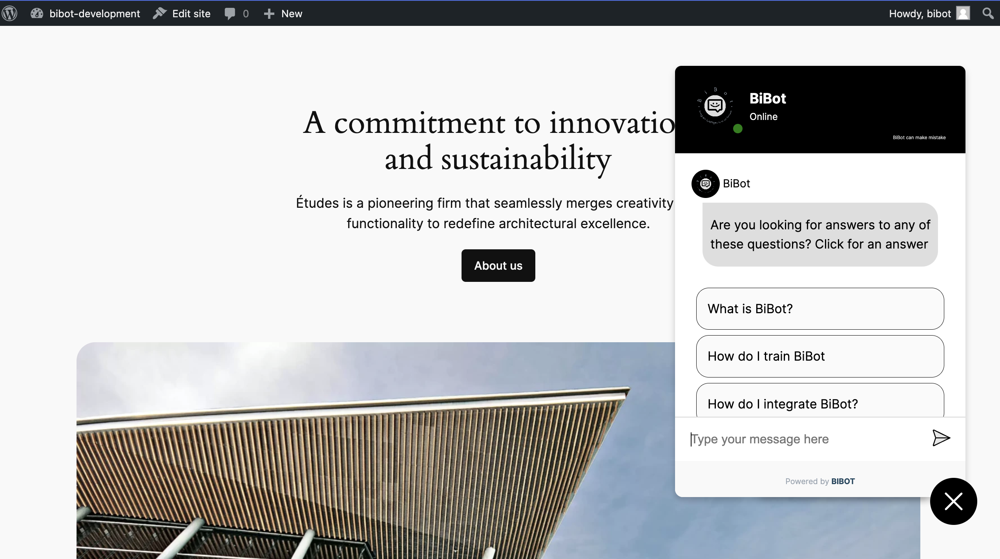

# BiBot Chatbot

**Contributors:** Chris Djin (@chrisdjin), Emmanuel Asare (@nanakwameasare)  
**Tags:** chatbot, ai, bot, integration  
**Requires at least:** 5.0  
**Tested up to:** 6.2  
**Stable tag:** 1.0  
**License:** GPLv2 or later  
**License URI:** http://www.gnu.org/licenses/gpl-2.0.html

## Short Description
Easily integrate the BiBot AI chatbot into your WordPress site with customizable settings for a seamless experience.

## Description

BiBot Chatbot allows you to easily integrate the BiBot AI chatbot into your WordPress site. The plugin is highly customizable, providing a range of settings for seamless integration with your existing WordPress setup.

## Local Installation

1. **Install the Plugin:**
   - You can install the plugin by either:
     - Uploading the `BiBot.zip` file directly via the "Install Plugin" page in the WordPress admin dashboard.
     - Or, manually uploading the unzipped `BiBot.zip` folder to the `/wp-content/plugins/` directory via FTP or your hosting control panel.

2. **Activate the Plugin:**
   - Go to the "Plugins" menu in WordPress and activate the BiBot Chatbot plugin.

3. **Configure the Plugin:**
   - Navigate to "Settings" > "BiBot Chatbot" in the WordPress admin dashboard to configure the plugin settings according to your needs.

## Frequently Asked Questions

### How do I get started with BiBot Chatbot?
Simply install the plugin, configure your Client ID, and adjust other settings as needed. The chatbot will automatically appear on your site.

### Can I customize the appearance of the chatbot?
Yes, you can adjust several settings through the plugin's settings page in the WordPress admin panel.

### Is the plugin compatible with my theme?
The BiBot Chatbot plugin is designed to work with most WordPress themes. If you encounter any issues, please contact support.

## Screenshots

1. **BiBot Settings Page:** The settings page where you configure the BiBot Chatbot.
   

2. **BiBot Chatbot in Action:** A live example of the BiBot Chatbot on a WordPress site.
   

## Changelog

### 1.0
* Initial release with core features for integrating BiBot Chatbot.

## Upgrade Notice

### 1.0
Initial release. No previous version available.

## License & Warranty

This plugin is provided "as is" without warranty of any kind. Use at your own risk. The plugin is licensed under the GNU General Public License (GPLv2 or later).
